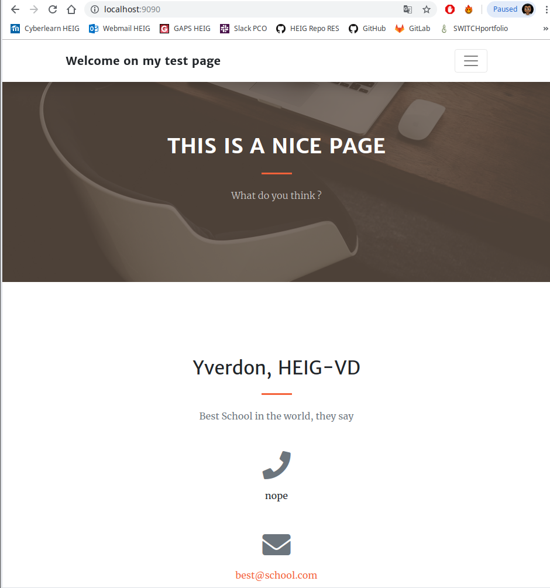

# Report Step 1

1. git clone https://github.com/Koffi94/Teaching-HEIGVD-RES-2019-Labo-HTTPInfra.git HTTP-Infra`

2. `git checkout -b fb-apache-static`

3. Go in **HTTP-Infra** directory.

4. `mkdir -p docker-images/apache-php-image/content`

5. Go in **apache-php-image** directory, `touch Dockerfile` and put the following content inside :

   ```dockerfile
   FROM php:7.2-apache
   COPY content/ /var/www/html/
   ```

6. Download zip bootstrap on <https://startbootstrap.com/themes/creative/>, unzip the file and put the content in content directory

7. Custom **index.html** as you want

8. Go in **apache-php-image** directory and build image with `docker build -t res/apache_php .`

9. Start the container with `docker run -d --rm -p 9090:80 res/apache_php`

10. Test the container with your browser web :

   
