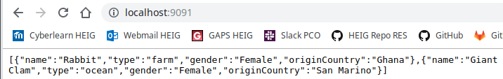
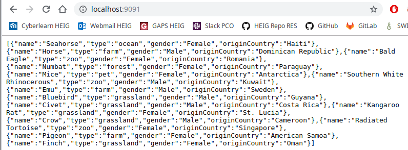
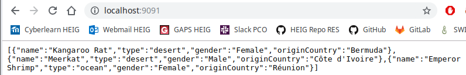

# Report Step 2

1. git clone https://github.com/Koffi94/Teaching-HEIGVD-RES-2019-Labo-HTTPInfra.git HTTP-Infra`

2. `git checkout -b fb-express-dynamic`

3. Go in **HTTP-Infra** directory

4. `mkdir -p docker-images/express-image/src`

5. Go in **express-images** directory, `touch Dockerfile` and put the following content inside :

   ```dockerfile
   FROM node:10.15.3
   COPY src /opt/app
   CMD ["node", "/opt/app/index.js"]
   ```

   Save it


6. Go in **src** directory

7. `npm init`

8. `npm install express --save `

9. ` npm install chance --save`

10. Then, you should get a **package.json** like this :

    ```json
    {
      "name": "students",
      "version": "0.1.0",
      "description": "Demo",
      "main": "index.js",
      "scripts": {
        "test": "echo \"Error: no test specified\" && exit 1"
      },
      "author": "Olivier Koffi",
      "license": "ISC",
      "dependencies": {
        "chance": "^1.0.18",
        "express": "^4.17.1"
      }
    }
    ```


11. `touch index.js` and put the following content inside :

    ```javascript
    var Chance = require('chance');
    var chance = new Chance();

    var express = require('express');
    var app = express();

    app.get('/', function(req, res) {
      res.send(generateStudents());
    });

    app.listen(3000, function () {
      console.log('Accepting HTTP requests on port 3000.')
    });

    function generateStudents() {
      var numberOfFruits = chance.integer({
        min: 1,
        max: 20
      });

      console.log(numberOfFruits);

      var animals = [];
      var types = ["ocean", "desert", "grassland", "forest", "farm", "pet", "zoo"];

      for(var i = 0; i < numberOfFruits; ++i) {
        var type = types[chance.integer({ min: 0, max: 6 })];
        var name = chance.animal({type: type});
        var gender = chance.gender();
        var originCountry = chance.country({ full: true });
        animals.push({
          name: name,
          type: type,
          gender: gender,
          originCountry: originCountry
        });
      }
      console.log(animals);
      return animals;
    }
    ```

    save it


12. `npm install` to install dependencies

13. Go in **express-image** directory and build image with `docker built -t res/express_students .`

14. Start container with `docker run -d --rm -p 9091:3000 res/express_students`

15. Test the container with your browser web :

    

    refresh page

    

    refresh page

    

