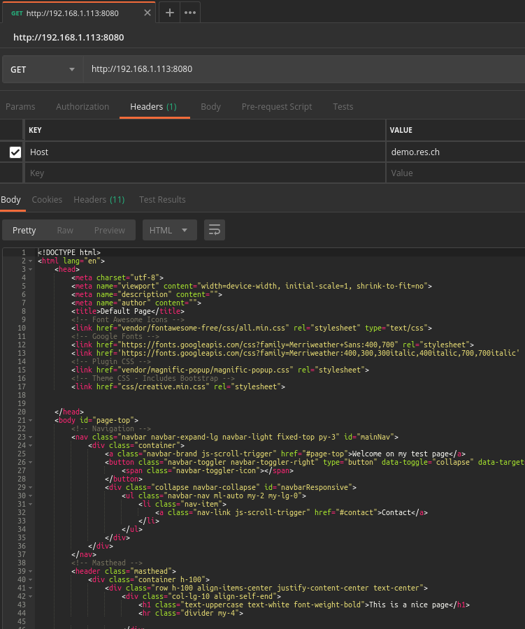
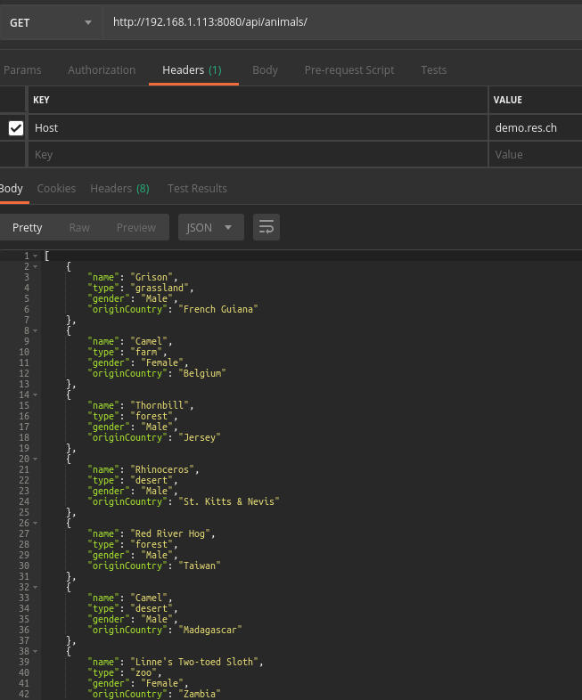
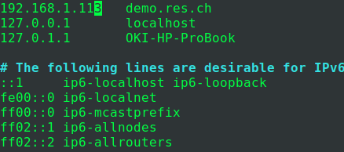
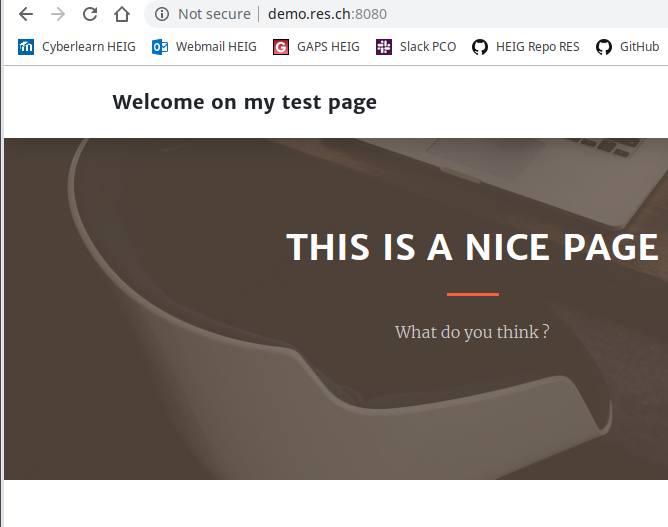
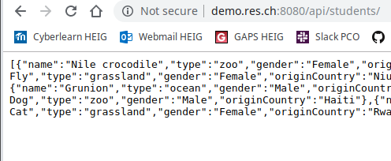

# Report Step 3

## Interactive mode

1. Start static and dynamic server container in this order :

   - `docker run -d --rm --name apache_static res/apache_php`
   - `docker run -d --rm --name express_dynamic res/express_students`

2. Create and migrate on a new branch for this step :

   - `git checkout -b fb-apache-reverse-proxy`

3. Start an interactive container to manually configure reverse proxy :

   - `docker run --rm -it -p 8080:80 php:7.2-apache /bin/bash`

4. In the container, go in  **/etc/apache2/sites-available**

5. `cp 000-default.conf 001-reverse-proxy.conf` and put the following content in 001 :

6. ```bash
   <VirtualHost *:80>
   	ServerName demo.res.ch
   
   	#ErrorLog ${APACHE_LOG_DIR}/error.log
   	#CustomLog ${APACHE_LOG_DIR}/access.log combined
   
   	ProxyPass "/api/students/" "http://172.17.0.3:3000/"
   	ProxyPassReverse "/api/students/" "http://172.17.0.3:3000/"
   
   	ProxyPass "/" "http://172.17.0.2:80/"
   	ProxyPassReverse "/" "http://172.17.0.2:80/"
   </VirtualHost>
   ```

7. Install required modules : `a2enmod proxy proxy_http`

8. Enable the new virtual site: `a2ensite 001*`

9. Reload Apache2 server :

   ~~~bash
   root@d0a856a02042:/etc/apache2/sites-available# service apache2 reload
   [ ok ] Reloading Apache httpd web server: apache2.
   ~~~

   ## Dockerfile mode

10. In **docker-images/apache-reverse-proxy**, create Dockerfile with the following content :

    ```dockerfile
    FROM php:7.2-apache
     
    COPY conf/ /etc/apache2
    
    RUN a2enmod proxy proxy_http
    RUN a2ensite 000-* 001-*
    ```

11. Test with PostMan :

    Set the correct host in header

    static page :

    


    dynamic page :

    


12. Configure **/etc/hosts** on the host :

    


13. Test with browser web :

    static page :

    

    
    dynamic page :

    

