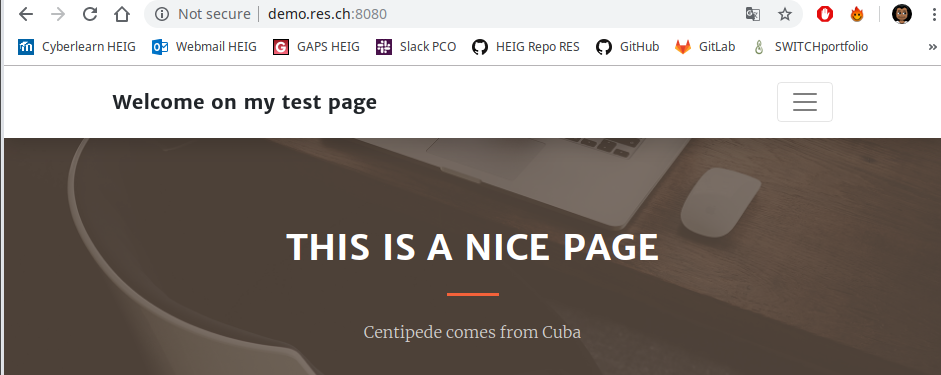
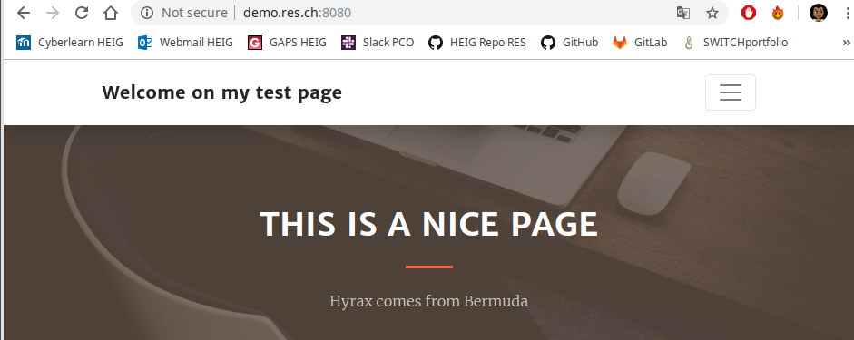

# Report Step 4

1. Add the following content in each **Dockerfile** (apache-php-image, apache-reverse-proxy, express-image) :

   ```dockerfile
   RUN apt-get update && \
       apt-get install -y vim
   ```

   

2. Rebuilt each images with `docker build -t res/xxx .`

3. `git add -A && git commit -a -m"Update Docker images to install vim"`

4. ```
   docker run -d --rm --name apache_static res/apache_php
   docker run -d --rm --name express_dynamic res/express_animals
   docker run -d -p 8080:80 --rm --name apache_rp res/apache_rp
   ```

   ## Interactive mode

5. `docker exec -it apache_static /bin/bash`

6. Edit **index.html** and add the following content :

   ```html
   <!-- Custom script to load animals -->
   <script src="js/animals.js"></script>
   ```

   

7.  Create and edit **js/animals.js** with the following content :

   ```javascript
   $(function() {
      console.log("loading animals");
   
      function loadAnimals() {
         $.getJSON("/api/animals/", function( animals ) {
   	     message = animals[0].name + " comes from " + animals[0].originCountry;
   	     $(".text-white-75").text(message);
         });
      };
   
      loadAnimals();
      setInterval( loadAnimals, 3000 );
   });
   ```

   

8. Test in web browser :

   

   

   ## Dockerfile mode

9. In **docker-images/apache-php-image/content**, edit **index.html** and **js/animals.js** exactly as I did it in  previous points.

10. Rebuild **res/apache_php** image

11. Rerun all containers in the correct order. You can run the script **deploy.sh** if you are not sure.

12. Retest with the web browser

13. `git add -A && git commit -a -m"Step 4 finished"` 