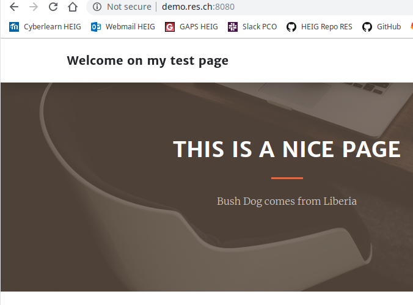

# Report Step 4

1.  Edit **docker-images/apache-reverse-proxy/templates/config-template.php** :

   ```php
   <?php
       $dynamic_app = getenv('DYNAMIC_APP');
       $static_app = getenv('STATIC_APP');
   ?>
   
   <VirtualHost *:80>
   	ServerName demo.res.ch
   
   	ProxyPass '/api/animals/' 'http://<?php print "$dynamic_app"?>/'
   	ProxyPassReverse '/api/animals/' 'http://<?php print "$dynamic_app"?>/'
   
   	ProxyPass '/' 'http://<?php print "$static_app"?>/'
   	ProxyPassReverse '/' 'http://<?php print "$static_app"?>/'
   </VirtualHost>
   ```

   

2. Edit **docker-images/apache-reverse-proxy/apache2-foreground** (for docker image php 7.2 apache) :

   ```bash
   #!/bin/bash
   set -e
   
   # Add setup for RES lab
   echo "Setup for the RES lab..."
   echo "Static app URL: $STATIC_APP"
   echo "Dynamic app URL: $DYNAMIC_APP"
   php /var/apache2/templates/config-template.php > /etc/apache2/sites-available/001-reverse-proxy.conf
   
   # Note: we don't just use "apache2ctl" here because it itself is just a shell-script wrapper around apache2 which provides extra functionality like "apache2ctl start" for launching apache2 in the background.
   # (also, when run as "apache2ctl <apache args>", it does not use "exec", which leaves an undesirable resident shell process)
   
   : "${APACHE_CONFDIR:=/etc/apache2}"
   : "${APACHE_ENVVARS:=$APACHE_CONFDIR/envvars}"
   if test -f "$APACHE_ENVVARS"; then
   	. "$APACHE_ENVVARS"
   fi
   
   # Apache gets grumpy about PID files pre-existing
   : "${APACHE_RUN_DIR:=/var/run/apache2}"
   : "${APACHE_PID_FILE:=$APACHE_RUN_DIR/apache2.pid}"
   rm -f "$APACHE_PID_FILE"
   
   # create missing directories
   # (especially APACHE_RUN_DIR, APACHE_LOCK_DIR, and APACHE_LOG_DIR)
   for e in "${!APACHE_@}"; do
   	if [[ "$e" == *_DIR ]] && [[ "${!e}" == /* ]]; then
   		# handle "/var/lock" being a symlink to "/run/lock", but "/run/lock" not existing beforehand, so "/var/lock/something" fails to mkdir
   		#   mkdir: cannot create directory '/var/lock': File exists
   		dir="${!e}"
   		while [ "$dir" != "$(dirname "$dir")" ]; do
   			dir="$(dirname "$dir")"
   			if [ -d "$dir" ]; then
   				break
   			fi
   			absDir="$(readlink -f "$dir" 2>/dev/null || :)"
   			if [ -n "$absDir" ]; then
   				mkdir -p "$absDir"
   			fi
   		done
   
   		mkdir -p "${!e}"
   	fi
   done
   
   exec apache2 -DFOREGROUND "$@"
   ```

   

3. Edit **docker-images/apache-reverse-proxy/Dockerfile** :

   ```dockerfile
   FROM php:7.2-apache
   
   COPY apache2-foreground /usr/local/bin/
   COPY templates/ /var/apache2/templates/
   COPY conf/ /etc/apache2COPY templates/ /var/apache2/templates/
   
   RUN apt-get update && \
       apt-get install -y vim
   RUN a2enmod proxy proxy_http
   RUN a2ensite 000-* 001-*
   ```

   

4. Rebuit image with `docker build -t res/apache_rp .`

   ## Testing

5. Run several containers :

   ```bash
   docker run -d --rm res/apache_php
   docker run -d --rm res/apache_php
   docker run -d --rm res/apache_php
   docker run -d --rm --name apache_static res/apache_php
   docker run -d --rm res/express_animals
   docker run -d --rm res/express_animals
   docker run -d --rm --name express_dynamic res/express_animals
   ```

   

6. Find ip with :

   ```bash
   docker inspect apache_static | grep -i ipadd && docker inspect express_dynamic | grep -i ipadd
               "SecondaryIPAddresses": null,
               "IPAddress": "172.17.0.5",
                       "IPAddress": "172.17.0.5",
               "SecondaryIPAddresses": null,
               "IPAddress": "172.17.0.8",
                       "IPAddress": "172.17.0.8",
   ```

   

7.  Run the reverse proxy with `docker run -d --rm -e DYNAMIC_APP=172.17.0.8:3000 -e STATIC_APP=172.17.0.5:80 --name apache_rp -p 8080:80 res/apache_rp`

8. Test in your web browser :

   

   

   

