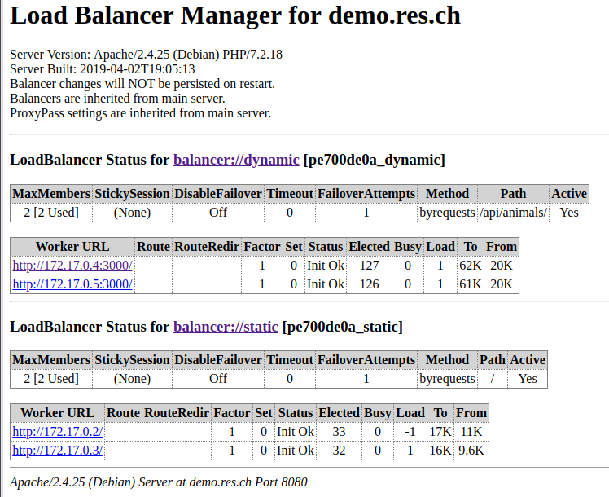

# Report Step 6

To configure *load-balancing* in the reverse proxy we need to add modules *lbmethod_byrequests* and *proxy_balancer*, edit the config file of the virtual host and test it.

1. Edit **docker-images/apache-reverse-proxy/Dockerfile**

   ```dockerfile
   FROM php:7.2-apache
   
   COPY apache2-foreground /usr/local/bin/
   COPY templates/ /var/apache2/templates/
   COPY conf/ /etc/apache2
   
   RUN apt-get update && \
       apt-get install -y vim
   RUN a2enmod lbmethod_byrequests proxy proxy_http proxy_balancer
   RUN a2ensite 000-* 001-*
   ```

   

2. Edit **docker-images/apache-reverse-proxy/templates/config-template.php**

   ```bash
   <?php
       $static_app_1 = getenv('STATIC_APP_1');
       $static_app_2 = getenv('STATIC_APP_2');
       $dynamic_app_1 = getenv('DYNAMIC_APP_1');
       $dynamic_app_2 = getenv('DYNAMIC_APP_2');
   ?>
   
   <VirtualHost *:80>
   	ServerName demo.res.ch
   
       <Location /balancer-manager>
         SetHandler balancer-manager
       </Location>
   
       ProxyPass /balancer-manager !
   
       <Proxy "balancer://dynamic">
           BalancerMember 'http://<?php print "$dynamic_app_1"?>/'
           BalancerMember 'http://<?php print "$dynamic_app_2"?>/'
       </Proxy>
   
       ProxyPass        '/api/animals/' 'balancer://dynamic/'
       ProxyPassReverse '/api/animals/' 'balancer://dynamic/'
   
       <Proxy "balancer://static">
           BalancerMember 'http://<?php print "$static_app_1"?>/'
           BalancerMember 'http://<?php print "$static_app_2"?>/'
       </Proxy>
   
       ProxyPass        '/' 'balancer://static/'
       ProxyPassReverse '/' 'balancer://static/'
       	
   </VirtualHost>
   ```

   Note : The balancer-manager allow to display informations about the clusters.

   

3. Run the script **deploy.sh** I made. It rebuilds all images and run containers.

   ```bash
   #!/bin/bash
   
   docker stop $(docker ps -aq) && docker rm $(docker ps -aq)
   
   docker build -t res/apache_php ./docker-images/apache-php-image/
   docker build -t res/express_animals ./docker-images/express-image/
   docker build -t res/apache_rp ./docker-images/apache-reverse-proxy/
   
   docker run -d --rm --name apache_static_1 res/apache_php
   docker run -d --rm --name apache_static_2 res/apache_php
   docker run -d --rm --name express_dynamic_1 res/express_animals
   docker run -d --rm --name express_dynamic_2 res/express_animals
   
   docker run -d --rm -e STATIC_APP_1=172.17.0.2:80 -e STATIC_APP_2=172.17.0.3:80 -e DYNAMIC_APP_1=172.17.0.4:3000 -e DYNAMIC_APP_2=172.17.0.5:3000 --name apache_rp -p 8080:80 res/apache_rp
   
   docker ps
   
   google-chrome "http://demo.res.ch:8080" &
   google-chrome "http://demo.res.ch:8080/balancer-manager" &
   ```

   

   ## Testing

   

4. Send several request at http://demo.res.ch:8080/ with **wget** for example or use my script **requestGenerator.sh**, then open the page <http://demo.res.ch:8080/balancer-manager>

   

   Note : We can see that static servers (.2 and .3) are called one after one, fairly. Dynamic servers (.4 and .5) are called fairly each second by each static servers.

   

5. Another test we can make. Simply kill a static and dynamic server and the connection should stay up.


Note : We can see that the servers stoped are Status **Init Error** but the clusters still **Active**.