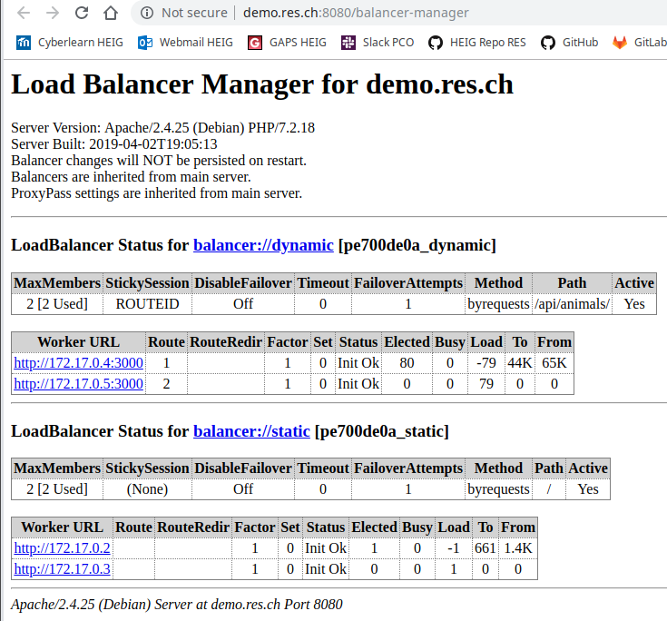
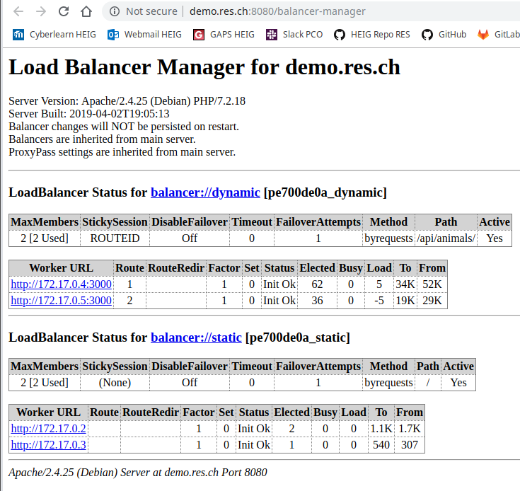

# Report Step 7

Sticky Session is a method used with Load Balancing, to achieve server affinity. In other words, it assigns a particular client with a particular server instance behind Load Balancer, so that HTTP session doesn’t get lost across application instances. <http://docs.motechproject.org/en/latest/deployment/sticky_session_apache.html>

1. Edit **docker-images/apache-reverse-proxy/Dockerfile**

   ```dockerfile
   FROM php:7.2-apache
   
   COPY apache2-foreground /usr/local/bin/
   COPY templates/ /var/apache2/templates/
   COPY conf/ /etc/apache2
   
   RUN apt-get update && \
       apt-get install -y vim
   RUN a2enmod lbmethod_byrequests proxy proxy_http proxy_balancer headers
   RUN a2ensite 000-* 001-*
   ```

   

2. Edit **docker-images/apache-reverse-proxy/templates/config-template.php**

   ```bash
   <?php
       $static_app_1 = getenv('STATIC_APP_1');
       $static_app_2 = getenv('STATIC_APP_2');
       $dynamic_app_1 = getenv('DYNAMIC_APP_1');
       $dynamic_app_2 = getenv('DYNAMIC_APP_2');
   ?>
   
   <VirtualHost *:80>
   	ServerName demo.res.ch
   
       <Location /balancer-manager>
         SetHandler balancer-manager
       </Location>
   
       ProxyPass /balancer-manager !
   
        Header add Set-Cookie "ROUTEID=.%{BALANCER_WORKER_ROUTE}e; path=/" env=BALANCER_ROUTE_CHANGED
       <Proxy balancer://dynamic>
           BalancerMember 'http://<?php print "$dynamic_app_1"?>' route=1
           BalancerMember 'http://<?php print "$dynamic_app_2"?>' route=2
           ProxySet stickysession=ROUTEID
       </Proxy>
   
       ProxyPass '/api/animals/' 'balancer://dynamic/'
       ProxyPassReverse '/api/animals/' 'balancer://dynamic/'
   
       <Proxy balancer://static>
           BalancerMember 'http://<?php print "$static_app_1"?>'
           BalancerMember 'http://<?php print "$static_app_2"?>'
       </Proxy>
       ProxyPass '/' 'balancer://static//'
       ProxyPassReverse '/' 'balancer://static/'
       	
   </VirtualHost>
   ```

   Note : With this configuration, requests for static servers are implemented in round-robin mode while requests for dynamic servers are implemented in sticky sessions mode.

   

3. Run the script **deploy.sh** I made. It rebuilds all images and run containers.

   ```bash
   #!/bin/bash
   
   docker stop $(docker ps -aq) && docker rm $(docker ps -aq)
   
   docker build -t res/apache_php ./docker-images/apache-php-image/
   docker build -t res/express_animals ./docker-images/express-image/
   docker build -t res/apache_rp ./docker-images/apache-reverse-proxy/
   
   docker run -d --rm --name apache_static_1 res/apache_php
   docker run -d --rm --name apache_static_2 res/apache_php
   docker run -d --rm --name express_dynamic_1 res/express_animals
   docker run -d --rm --name express_dynamic_2 res/express_animals
   
   docker run -d --rm -e STATIC_APP_1=172.17.0.2:80 -e STATIC_APP_2=172.17.0.3:80 -e DYNAMIC_APP_1=172.17.0.4:3000 -e DYNAMIC_APP_2=172.17.0.5:3000 --name apache_rp -p 8080:80 res/apache_rp
   
   docker ps
   
   google-chrome "http://demo.res.ch:8080" &
   google-chrome "http://demo.res.ch:8080/balancer-manager" &
   ```

   

   ## Testing

   

4. Open one page at http://demo.res.ch:8080/ with your browser web, then open the page <http://demo.res.ch:8080/balancer-manager> and wait ...

   

   Note : We can see that dynamic servers are now in *sticky sessions* mode and with only one page open, it's always the same dynamic servers that are used by the static server because there is a session.

   

5. Now open another page at http://demo.res.ch:8080/ and refresh.

   

Note : Now we can see that the second dynamic server (.5) has been selected for the new static server request. With this test, we can see that each new connection to a static server generate a new session with the dynamic server.