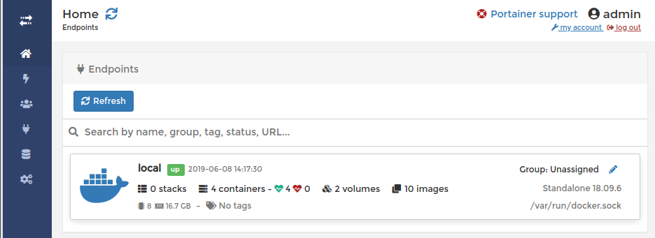

# Report Step 9

1. git clone https://github.com/Koffi94/Teaching-HEIGVD-RES-2019-Labo-HTTPInfra.git HTTP-Infra`

2. `git checkout -b fb-ui-management`

3. In the main directory, run the `deploy.sh` script.

4. After that, you can run the following command : 
`docker run -d -p 9000:9000 --name portainer --restart always -v /var/run/docker.sock:/var/run/docker.sock -v portainer_data:/data portainer/portainer`

5. Open a Web Browser of your choice and type in : `http://localhost:9000`.

6. Log into the application with these creds : 
  login : `admin` 
  pass : `12341234`.

  

